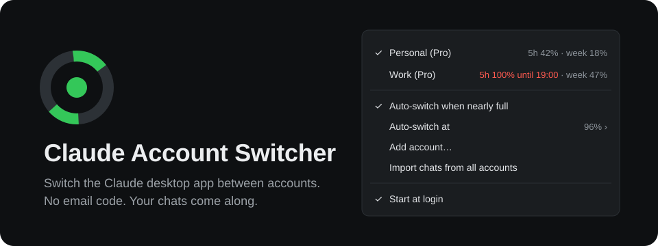

<div align="center">



**Hit your limit on one Claude account, keep working on the next one. One click, no email code.**

A tray tool for the Claude desktop app. It swaps the signed-in account in about ten seconds,
carries your Claude Code chats across, and shows the live usage of every account you own.

**Your sign-ins never leave your machine.** Tokens stay encrypted exactly as Claude stored them,
and the only server the switcher talks to is `api.anthropic.com`.

Unofficial. Not affiliated with or endorsed by Anthropic.

</div>

---

## The problem

You have two Claude accounts because one runs out. Switching between them in the desktop app goes like this:

1. **Sign out.** That throws the sign-in away. Next time you need it, you start from zero.
2. **Sign in with the other address and wait for the email code.** With a private relay address, that means opening another app to find it.
3. **Find your work.** Claude files Claude Code chats per account, so the chat you were in the middle of is gone from the sidebar. The conversation still exists on disk; the app just does not list it.
4. **Guess** which account has room left, because usage only shows for the one you are signed in to.

Three of those four steps are pure overhead, and the fourth is a guess.

## What it does instead

**Keeps every sign-in.** Each account's sign-in is saved when you switch away from it and put back when you switch to it. You type an email code once per account, ever, and not again until Anthropic ends that sign-in.

**Switches in one click.** Right-click the tray icon, pick an account. Claude quits, the sign-in is swapped, Claude starts again. Everything else in Claude's settings stays exactly as it was.

**Brings your chats along.** Before Claude starts, the switcher copies the chat list entries of your other accounts into the one you switch to. Open the chat you were in and keep going. Chats you deleted stay deleted.

**Shows usage for all accounts at once.** 5-hour and weekly usage for every saved account, live, with the reset time once a limit is close. The tray icon is a ring that fills with the active account's 5-hour usage: green, orange from 75%, red at your switch threshold.

**Can switch on its own.** Off by default. Turn it on and the switcher moves Claude to the account with the most room left once the active one passes 96% (or 90, 94, 98, your choice).

## Measured

The first real run, on Windows 11 with the Microsoft Store version of Claude, from the switcher's own log:

| Step | Time |
| --- | --- |
| Add a second account, including typing its email code | 44 s |
| Detect the new sign-in, import the missing chats, restart Claude | 9 s |
| Switch accounts, from the click until Claude starts again | 9 s |
| Round trip of Claude's real `config.json` through the switcher | byte-identical |

## Install

Grab the build for your platform from **Releases** and run it. No installer, no runtime, one file.

- **Windows 10/11:** `claude-account-switcher-windows-amd64.exe`. Works with the Microsoft Store app and the direct download.
- **macOS:** `claude-account-switcher-macos` (universal). The first start asks once whether it may read "Claude Safe Storage" from your keychain; that is the key Claude uses to encrypt its sign-in. Builds in CI, not yet tested on a real Mac. Reports welcome.
- **Linux:** there is no official Claude desktop app, so there is nothing to switch.

Then turn on **Start at login** in its menu.

## First run

1. Start the switcher while you are signed in to Claude. It picks up that account within a minute.
2. Choose **Add account…**. Claude restarts on its sign-in screen. Your first account is kept.
3. Sign in with the second account. The switcher notices, restarts Claude once more, and the chats of your other account show up.

From then on, click an account to switch.

> [!IMPORTANT]
> **Never use Sign out in Claude to change accounts.** Signing out can end that sign-in on Anthropic's side, and the switcher's saved copy stops working. The account then shows "signed out, add it again". Use **Add account…** to sign it in once more.

## Auto-switch

When it is on, all of these have to hold before the switcher acts:

| Rule | Why |
| --- | --- |
| The active account is at or above the threshold, 5-hour or weekly | 96% by default, so the switch lands before a reply gets cut off at 100% |
| Another account is at least 10 points below the threshold | No bouncing onto an account that is nearly full too |
| That account's usage was checked in the last 10 minutes | No decisions on stale numbers |
| The last switch was more than 10 minutes ago | No ping-pong |
| Claude is running | It never starts Claude behind your back |

A switch restarts Claude. A reply that is being written at that moment stops, and you continue it in the same chat on the other account.

Anthropic's terms do not forbid having more than one account. They do forbid "bypassing any of our systems or protective measures". Whether automatic switching fits how you use your accounts is your call, which is why it is off until you turn it on.

## How it works

Claude keeps its sign-in in two places inside its data folder:

| Platform | Data folder |
| --- | --- |
| Windows, Microsoft Store app | `%LOCALAPPDATA%\Packages\Claude_<id>\LocalCache\Roaming\Claude` |
| Windows, direct download | `%APPDATA%\Claude` |
| macOS | `~/Library/Application Support/Claude` |

| What | Where | What the switcher does with it |
| --- | --- | --- |
| Sign-in tokens | `config.json`: `oauth:tokenCacheV2`, `oauth:tokenCache`, `lastKnownAccountUuid` | Saves and restores these three entries, leaves every other entry untouched |
| Web session | `Network/Cookies` | Saves and restores the file while Claude is closed |
| Chat list | `claude-code-sessions/<account>/<organization>/local_<id>.json` | Copies missing entries in, refreshes older ones, never deletes |
| Deleted chats | `deleted_<id>` next to the entries | Reads them, so a deleted chat is never copied back |
| Conversations | `~/.claude/projects` | Nothing. They are shared by all accounts already |

Before each switch, `config.json` and the cookie store are backed up. The last 10 backups are kept. If any step fails, the backup goes back and the error shows at the top of the menu.

**Usage.** The saved token cache is decrypted in memory with Claude's own key (DPAPI on Windows, the keychain on macOS). The switcher then asks `api.anthropic.com` for each account's profile and usage, the same endpoints Claude and Claude Code use themselves. The active account is checked every minute, the others every five. Claude's tokens last about a month, so a saved account keeps showing live usage without being signed in.

**The Store app quirk.** Programs started from inside the Store version of Claude, a Claude Code terminal for example, see a redirected AppData folder. The switcher notices when it was started that way and starts itself again through Explorer, so it sees the real files and survives Claude quitting.

## Your data

| | |
| --- | --- |
| Saved sign-ins, state, backups, log | `~/.claude-account-switcher` (`%USERPROFILE%\.claude-account-switcher` on Windows), **Open data folder** in the menu |
| Tokens | Stored exactly as Claude encrypted them. Never written in plain text, never sent anywhere but `api.anthropic.com` |
| Remove an account | Quit the switcher, delete its folder under `accounts/` and its entry in `state.json` |
| Uninstall | Turn off **Start at login**, quit, delete the binary and the data folder |

## Command line

```
claude-account-switcher -status
```

Prints every saved account with its usage and exits.

## Build

Go 1.26 or newer.

```bash
go test ./...
go build -ldflags "-H=windowsgui -s -w" -o claude-account-switcher.exe .   # Windows
CGO_ENABLED=1 go build -o claude-account-switcher .                        # macOS
```

One dependency beyond the standard library: [`fyne.io/systray`](https://github.com/fyne-io/systray) for the tray icon, plus `golang.org/x/sys` on Windows.

## Caveats

This relies on how the Claude desktop app stores its files today, not on a published interface. An app update can change that. When it does, the switcher fails loudly, restores its backup and says so in the menu. It does not guess.

## License

[PolyForm Noncommercial 1.0.0](LICENSE). **Free for personal use**, and free for schools, charities, research and government. Using it at a company, for paid client work, or inside anything you sell needs a commercial license. Ask [@SnlperStripes](https://github.com/SnlperStripes).

**Credit is part of the deal.** Anyone who passes this on, changed or not, has to pass on the license and its `Required Notice` line, which names the author and links back here.
